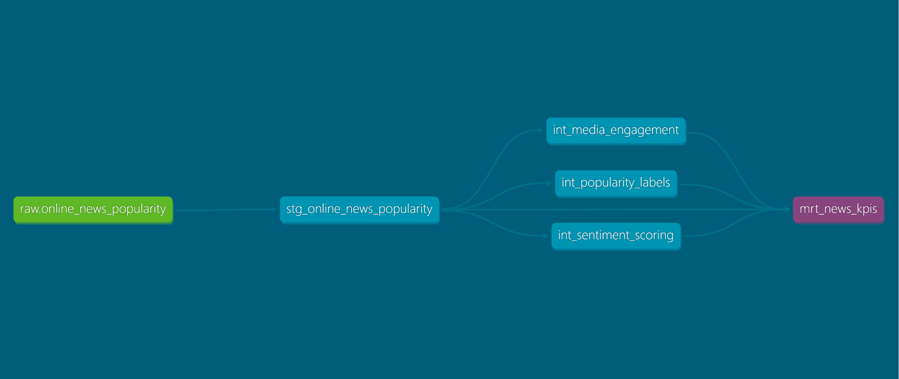

# Online News Popularity – dbt + PostgreSQL Project

This mini-project showcases a modern **analytics engineering** workflow using **PostgreSQL + dbt + dbt-utils** on the [Online News Popularity](https://archive.ics.uci.edu/dataset/332/online+news+popularity) dataset.

The goal is to model, test, and document the data in a clean **staging → intermediate → mart** architecture that can be used for BI or ML use cases (e.g. predicting article popularity).

---

## 🎯 Business Problem

We want to understand which factors drive **article popularity** (measured as number of social media `shares`), based on:

- Article structure: title length, content length, tokens
- Embedded media: images, videos, and links
- Topic distribution (LDA features)
- Sentiment and subjectivity scores (title + content)

This project builds a reusable, tested data model that can be consumed by:

- BI tools (e.g. Power BI)
- Data scientists (for feature engineering / modeling)
- Analysts (for exploratory analysis)

---

## 🧱 Tech Stack

- **PostgreSQL** – data warehouse for raw + transformed tables
- **dbt-core + dbt-postgres** – SQL-based transformations, tests, and documentation
- **dbt-utils** – expression-based data quality checks
- **Python / virtualenv** – environment management
- **VS Code** – development IDE

---

## 🏗 Data Model Architecture

Layered modeling using dbt:

### 1. Source (raw)

- **`raw.online_news_popularity`**
  - Table loaded from the original CSV into PostgreSQL.
  - Contains all 60+ features from the dataset.

### 2. Staging (`stg_`)

- **`stg_online_news_popularity`**
  - 1:1 with the raw table, focused on:
    - Clean column names and types
    - A single, consistent interface for downstream models
  - Basic tests:
    - `url`: `not_null`, `unique`
    - `shares`, `n_tokens_title`, `n_tokens_content`: `not_null`

### 3. Intermediate (`int_`)

These models apply focused transformations and feature engineering:

- **`int_media_engagement`**
  - Derived columns:
    - `total_media = num_imgs + num_videos`
    - `total_links = num_hrefs + num_self_hrefs`
  - Tests:
    - `url`: `not_null`, `unique`, relationships to staging
    - `total_media`: `not_null`, `total_media >= 0` (via `dbt_utils.expression_is_true`)
    - `total_links`: `not_null`

- **`int_popularity_labels`**
  - Uses `shares` to create a categorical label:
    - `low`, `medium`, `viral` (thresholds defined in the SQL model)
  - Tests:
    - `url`: `not_null`, relationship to staging
    - `shares`: `not_null`, `shares > 0` (via `dbt_utils.expression_is_true`)
    - `popularity_label`: `not_null`, `accepted_values` in `['low', 'medium', 'viral']`

- **`int_sentiment_scoring`**
  - Combines:
    - `title_sentiment_polarity`
    - `global_sentiment_polarity`
  - Creates:
    - `sentiment_score` = average of title + global polarity
  - Tests:
    - `url`: `not_null`, relationship to staging
    - `title_sentiment_polarity`, `global_sentiment_polarity`, `sentiment_score`:
      - `not_null`
      - constrained to `[-1, 1]` via `dbt_utils.expression_is_true`

### 4. Marts (`mrt_`)

Final curated tables for analytics / BI:

- **`mrt_news_kpis`**
  - Aggregated KPIs by popularity segment, e.g.:
    - average shares
    - average sentiment score
    - media/link usage statistics

- (Optional extension) **`mrt_popularity_features`**
  - Feature-ready table joining:
    - engagement metrics
    - sentiment scoring
    - popularity labels
  - Suitable for feeding into dashboards or ML models.

---

## 🧪 Data Quality & Testing

Tests implemented with **dbt core** and **dbt-utils**:

- **Schema tests**
  - `not_null`, `unique`, `accepted_values`, `relationships`

- **Custom expression tests** (dbt-utils)
  - `total_media >= 0`
  - `shares > 0`
  - `title_sentiment_polarity`, `global_sentiment_polarity`, `sentiment_score` in `[-1, 1]`

Running `dbt test` ensures upstream data + transformations respect basic quality constraints before being used for analytics.

---

## 🔍 Lineage (DAG)

The dbt DAG clearly shows the flow:

## 🔍 Lineage (DAG)

